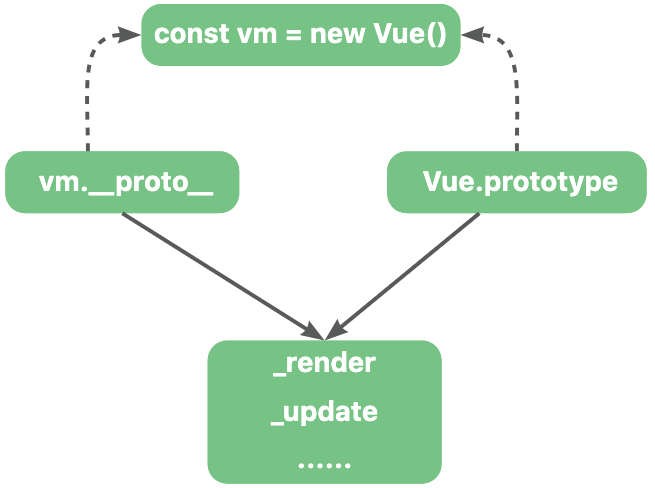
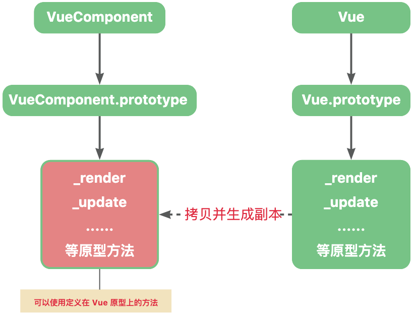
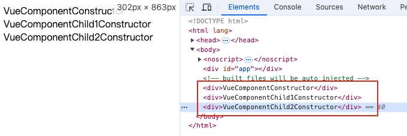
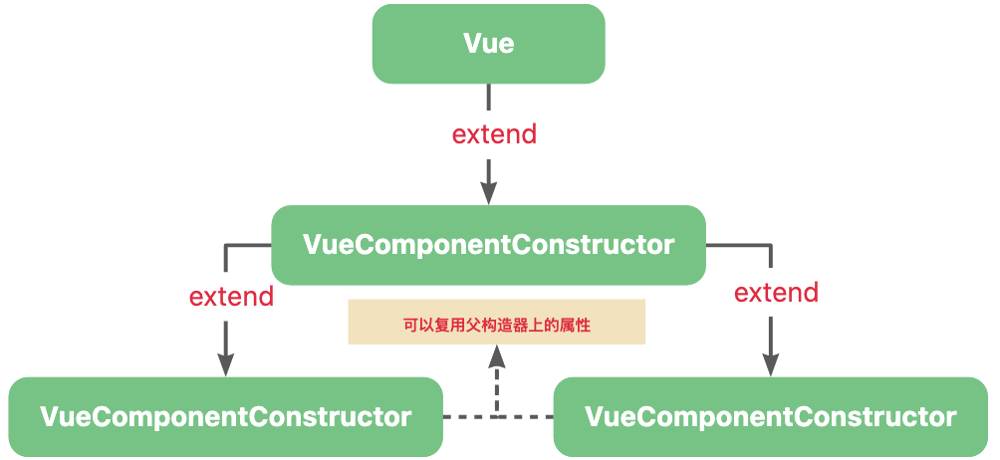
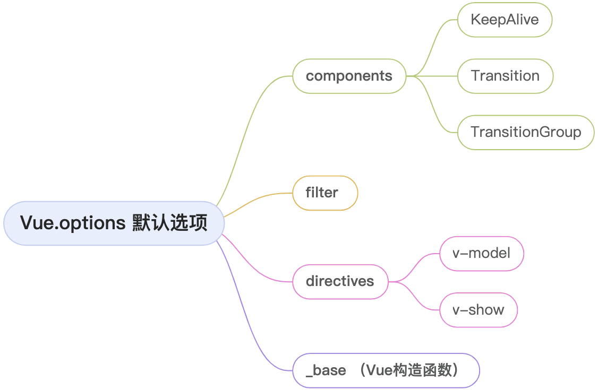
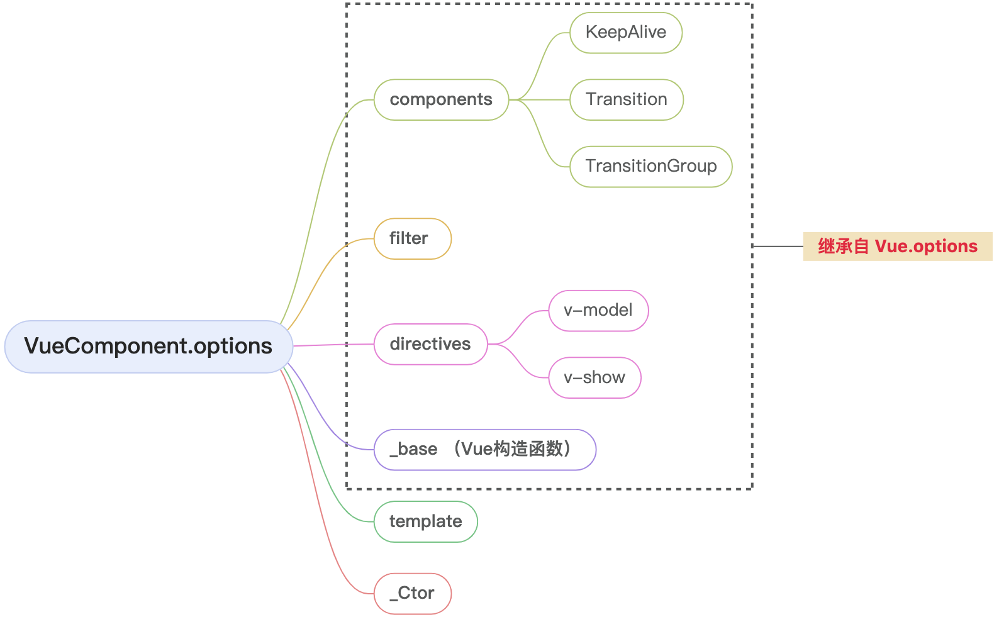
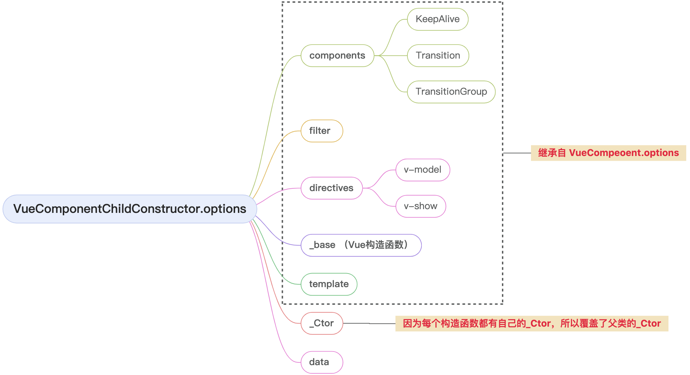
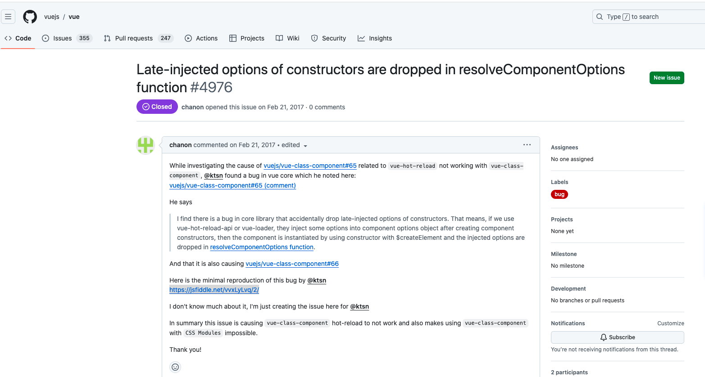

🔥 浅析Vue中的原型设计与选项合并

# 一、Vue的原型设计

Vue是一个基于原型设计的前端框架。

在Vue被引入（`import Vue from 'vue'`）时，会通过多个函数给Vue原型上添加上一系列的方法。

```js
// 该函数在 Vue被引入时执行
export function lifecycleMixin(Vue){
    Vue.prototype._update = ()=>{
        // xxxx
    }
}
```

那么在`Vue.prototype`上定义方法有什么作用呢？ 

如下，Vue本质上是一个构造函数：

```js
function Vue(){
    //xxx
}
```

所以我们可以通过 `new关键字` 来创建一个 vue实例。

```js
const vm = new Vue();
```

> 1. `构造函数与原型对象`：每个构造函数都有一个 prototype属性，指向一个对象。这个对象被叫做原型对象，包含了由该构造函数创建的实例共享的属性和方法。
>
> 2. `实例对象的 __proto__ 属性`：每个实例对象都有一个 `__proto__` 属性，指向构造函数的原型对象。

所以我们可以得出结论：`Vue构造函数的显式原型（Vue.prototype）和基于它创建的实例的隐式原型（vm.__proto__）指向的是同一块内存空间`。



当 Vue实例访问某个属性时，如果在自身属性中找不到，则会沿着__proto__属性指向的原型对象进行查找，所以通过 vm 可以访问到定义在 Vue.prototype 的属性和方法。

而Vue构造函数同时也是 Function 的实例。

所以：`Vue.__proto__.constructor === Function`。

# 二、Vue.extend利用原型链继承生成“子类“构造函数

Vue.extend是定义在Vue这个构造函数上的方法。

该方法主要用于创建Vue构造函数的“子类“，该“子类“继承 Vue构造函数上的原型方法和原型属性。

虽然Vue在技术上不是传统意义上的类，但是`Vue.extend`提供了一种类似于面向对象编程中继承的方式来定义组件。 

```js
// 对原函数进行了一些简化 只保留了核心
Vue.extend = function(){
    // this 为 Vue构造函数
    const Super = this;
    // Sub 为 VueComponent构造函数，代表组件构造函数
    const Sub = function VueComponent(this){
        // 和 Vue构造函数一样 会调用_init方法
        this._init(options);
    };
    // 基于 Vue.prototype 创建一块新的内存，共享其属性和方法。
    Sub.prototype = Object.create(Super.prototype);
    // 修正 constructor指向
    Sub.prototype.constructor = Sub;
    return Sub;
}
``` 
我们简单的分析一下这几行代码。

> 声明了Super变量和 Sub变量分别指向`Vue构造函数`，和 `VueComponent构造函数`。



如上图所示，基于`Vue原型对象`创建了一块新的内存地址，并将`VueComponent构造函数`的原型对象指向这块地址。
 
所以基于`VueComponent构造函数`创建的实例可以使用定义在 Vue原型上的属性和方法，并且在 `VueComponent构造函数`上修改属性和方法并不会影响到 `Vue构造函数`。 

> 因为原型对象上存在 constructor，所以需要进行修正constructor来确保 constructor指向正确的`VueComponent构造函数`。

因为VueComponent构造函数“继承”了Vue构造函数的属性和方法。

所以可以把VueComponent构造函数看成是Vue构造函数的“子类“。

> 这种实现继承的方法被称为`原型链继承`。  

## 2.1 使用场景

在Vue源码内部和Vue编写业务代码时都可以使用 Vue.extend这个 api。

### 2.1.1 内部创建组件

每一个Vue组件都对应着一个实例。

而这些实例都是通过 extend 方法创建的 `VueComponent构造函数` 生成的。 

在render阶段，也就是在生成组件的vnode的时候会通过 extend 方法创建`VueComponent构造函数`。

并赋值到 vnode 中的 componentOptions属性中。

> 这里的`_base`实际上就是 Vue。

```js
export function createComponent(Ctor,context){
    // _base在引入时被设置为 Vue
    // 这里的options后面我们会详细说明
    const base = context.$options._base;
    // 创建Vue子类构造函数
    Ctor = base.extend();
    return new Vnode(
        {componentOptions:{Ctor}}
    )
}
```

> 这里的 context是vm实例，`vm.$options`是在实例化构造函数时通过 `mergeOptions`函数生成的。

然后在update阶段（渲染页面），会基于Ctor生成对应的实例，执行相应的初始化、渲染方法等。

```js
// 每个组件都会调用这个方法来创建对应的实例
// 这里的 componentOptions.Ctor 就是对应的VueComponent构造函数
export function createComponentInstanceForVnode(vnode){
    return new vnode.componentOptions.Ctor()
}
``` 

### 2.1.2 在业务中的实际应用场景

在实际业务场景中，有很多地方都可以利用 extend 来扩展组件。

包括创建`可复用的组件`、`动态组件`、`全局和局部注册`、`临时组件`、`自定义指令和插件`。

我们常用的 Element框架内部就利用了 Vue.extend 来扩展某些临时性的组件，例如模态对话框、提示信息等。

通过 Vue.extend 创建的组件构造函数可以按需创建和销毁，适合这类临时组件的管理。

```js
const Main = {
    template:'<div>hello main</div>'
}

const NotificationConstructor = Vue.extend(Main);

let instance;

const Notification = function() {
    // 通过VueComponent创建组件实例
    instance = new NotificationConstructor();
    // 使用$mount可以创建一个DOM节点 并挂载到instance.$el上
    instance.$mount();
    document.body.appendChild(instance.$el);
    return instance;
} 

Notification();
```

> $mount方法如果没有传参不会挂载，但是依旧可以生成 DOM节点，并赋值在 vm.$el上。

在 element 中的 Notification组件 就使用了 extend 进行扩展。

## 2.1.3 使用VueComponent继续扩展

需要关注的是在Vue.extend中，将Vue.extend方法同时赋值给了 VueComponent。

意味着赋予了 VueComponent继续扩展的能力：

```js
Vue.extend = function(){
    const Super = this;
    const Sub = function VueComponent(){
        this._init();
    }
    // 省略部分代码
    Sub.extend = Super.extend;
}
```

这意味着我们可以无限的基于 VueComponent扩展子类。

```js
import Vue from "@/my-vue2/platforms/web/entry-runtime-with-compiler-esm"

// 基于Vue构造函数创建的基础构造函数
const VueComponentConstructor = Vue.extend({
    template:`<div>{{ name }}我是构造函数</div>`,
    data(){
        return {
            name:"VueComponentConstructor"
        }
    }
});
// 可以复用父类构造器VueComponentConstructor上的属性
const VueComponentChild1Constructor = VueComponentConstructor.extend({ 
    data(){
        return {
            name:"VueComponentChild1Constructor"
        }
    }
})
// 可以复用父类构造器VueComponentConstructor上的属性
const VueComponentChild2Constructor = VueComponentConstructor.extend({ 
    data(){
        return {
            name:"VueComponentChild2Constructor"
        }
    }
})

function addNode(){
    const vm1 = new VueComponentConstructor();
    const vm2 = new VueComponentChild1Constructor();
    const vm3 = new VueComponentChild2Constructor();

    vm1.$mount()
    vm2.$mount()
    vm3.$mount()

    document.body.appendChild(vm1.$el)
    document.body.appendChild(vm2.$el)
    document.body.appendChild(vm3.$el)
}

addNode();
```

上述代码中，VueComponentConstructor 是通过 Vue.extend 创建的一个基础组件构造器。

在这个基础构造器中传入了模板选项，我们之后创建的构造器就可以复用 template选项，避免重复编写重复的模板。


 
我们这里只是简单的举了一个例子，通过这个例子我们了解到了extend的重要意义。真实的复用结构肯定更为复杂。 

不过在实际开发中，我们系统中基本只存在 Vue构造函数和它的直接构造函数 VueComponent。

# 三、Vue构造器的默认选项 

在实例化Vue时，通常我们会将选项对象传入构造器中，然后注入进Vue实例上便于以后使用。

这些选项可以是 `template定义渲染模板`、`data 定义响应式数据`、`methods定义方法`、`components注册组件`等等。

```js
new Vue({
    template:`<div @click="handleClick">{{ name }}</div>`,
    data(){
        return {
            name:'测试'
        }
    },
    methods:{
        handleClick(){}
    }
})
```

我们知道 Vue 也是Function构造函数的实例对象，所以可以在 Vue构造函数上定义一些属性。

Vue.options 即代表Vue的选项。

而Vue内部本身会自带一些默认的选项，这些选项和用户自定义的选项会在后续一起参与到Vue实例的初始化中。

在Vue被引入时，会执行多个方法给Vue.options注入属性。

## 3.1 initGlobalAPI方法创建 Vue.options

initGlobalAPI方法在Vue被引入时执行。

```js
// core/global-api/index.ts

const ASSET_TYPES = ['component','directive','filter'];

const builtInComponents = {
    KeepAlive
}

export function initGlobalAPI(Vue){
    // Object.create用于创建一个没有原型的对象
    Vue.options = Object.create(null)
    ASSET_TYPES.forEach(type => {
      Vue.options[type + 's'] = Object.create(null)
    });
    Vue.options._base = Vue; 
    extend(Vue.options.components, builtInComponents) 
}
```

可以看到，installGlobalAPI方法中创建了 Vue.options为一个纯净的空对象，然后在options上面注入了一些属性。

> 之前我们提到的，每个Vue组件都是通过_base属性获取到Vue构造函数，然后使用Vue.extend来生成对应的 VueComponent构造函数。 

> extend方法是vue中的一个通用方法。
>
> 用于将第二个参数的值合并到第一个参数中，返回第一个参数。
>
> 第二个参数的值直接覆盖进第一个参数

```js
export function extend(
  to,
  _from
){
  for (const key in _from) {
    to[key] = _from[key]
  }
  return to
}
```


## 3.2 合并指令

该段逻辑在Vue被引入时执行。

```js
// platforms/web/runtime/index
const platformDirectives = {
    model,
    show
}

const platformComponents = {
    Transition,
    TransitionGroup
}


extend(Vue.options.directives, platformDirectives)
extend(Vue.options.components, platformComponents)
```
## 3.3 总结

经过我们的研究发现，Vue构造函数的默认选项有：

1. `_base`：值即为Vue构造器，用于后续创建组件的构造器。
2. `directive`：代表需要注册的指令，默认的提供了 v-model、v-show的内置指令。
3. `components`：代表需要注册的组件选项，默认提供了 KeepAlive、Transition、TransitionGroup的内置组件。
4. `filter`：代表需要注册的过滤器，默认没有提供默认值。



# 四、子类构造函数的options

学习完上节我们知道在Vue被引入时，在Vue构造函数上创建了一些默认选项。

而 VueComponent构造函数作为 Vue构造函数的子类，是不是也继承了它的默认选项呢？

我们继续打开 Vue.extend 的源码一探究竟。

```js
Vue.extend = function(extendOptions){
    extendOptions = extendOptions || {}
    // 新增_Ctor属性 
    const cachedCtors = extendOptions._Ctor || (extendOptions._Ctor = {})
    const Super = this;
    const Sub = function VueComponent(){
        this._init();
    } 
    // mergeOptions用于合并2个选项返回一个合并选项
    Sub.options = mergeOptions(Super.options, extendOptions)
}
```

虽然我们不知道 mergeOptions的具体逻辑，但是我们很容易看出来，VueComponent构造函数上的 options属性合并了“父类“构造函数上的options属性以及自身传入的 options选项。

> 在 VueComponent构造函数上新增了一个_Ctor属性，可以避免每次重新创建子类，提高性能，后面我们会专门说这里，这里不进行展开。

所以我们可以得出一个结论：`子类构造函数的 options选项继承了其父类构造函数的 options选项`。

举个例子：

```js
const VueComponentConstructor = Vue.extend({
    template:`<div>我是子类构造器</div>`
}); 
``` 
此时 VueComponentConstructor.options 上既包含了自身传入的 template 选项，也包含了继承自Vue构造函数上的属性。

> 这里需要注意的是，继承只是拷贝了一个副本，并不会影响 Vue构造函数的属性。



我们知道，VueComponent构造函数本身是具有再次扩展的能力的。 

```js
const VueComponentChild1Constructor = VueComponentConstructor.extend({
    data(){
        return {
            name:"VueComponentChild1Constructor"
        }
    }
})
```
同理，`VueComponentChild1Constructor是VueComponentConstructor的子类，所以VueComponentChild1Constructor就继承了VueComponentConstructor的 options`。



> 需要注意的时，此时继承的属性时从 VueComponent中继承过来的，跟 Vue.options实际上没有关系了。

# 五、resolveConstructorOptions

前面我们说了`Vue/VueComponent 构造函数`上的选项。

接下来我们应该研究对应的实例上的选项是如何合并的。

但是在此之前，我们应该需要了解一下`resolveConstructorOptions`函数。

这个函数用于获取对应构造函数的options选项。

在实例上注入时需要合并对应构造函数上的 option，和自身的 options。

```js
export function resolveConstructorOptions(Ctor){
    let options = Ctor.options;
    if (Ctor.super) {
        const superOptions = resolveConstructorOptions(Ctor.super)
        const cachedSuperOptions = Ctor.superOptions
        if (superOptions !== cachedSuperOptions) {
            // super option changed,
            // need to resolve new options.
            Ctor.superOptions = superOptions
            // check if there are any late-modified/attached options (#4976)
            const modifiedOptions = resolveModifiedOptions(Ctor)
            // update base extend options
            if (modifiedOptions) {
                extend(Ctor.extendOptions, modifiedOptions)
            }
            options = Ctor.options = mergeOptions(superOptions, Ctor.extendOptions)
            if (options.name) {
                options.components[options.name] = Ctor
            }
        }
    }
    return options;
}
```
看到这么多代码，想必大家也是极其懵逼的。

因为我们之前学过 `Vue.options 是在初始化时注入的`。

而 `VueComponent及其扩展` 的options选项则是在extend方法中进行注入的。

那直接获取构造函数的 options不就行了，为什么还有这么一大段逻辑。

其实这一段逻辑主要是应对构造函数变化的情况。

## 5.1 Ctor.super

在生成子类构造器时，会在子类构造器上新增了一个 super属性，指向他的父类

```js
Vue.extend = function(){
    let Sub = function VueComponent(){
        this._init
    }
    let Super = this;
    // 省略部分代码
    Sub['super'] = Super;
}
```

所以如果存在 super属性，则代表这是使用 extend生成的 VueComponent构造函数。
1. 没有super属性，代表这是 Vue构造函数，直接返回 Vue.options即可。
2. 如果存在super属性，代表这是 Vue.extend生成的 VueComponent构造函数，需要进行进一步判断。

## 5.1 Vue旧版本的 bug

从代码的注释中我们可以看到[github issue #4976](https://github.com/vuejs/vue/issues/4976)



这个bug的大概意思就是说：`先生成VueComponent构造函数，然后再在构造函数上的 options 添加属性，在resolveComponentOptions函数执行后，后添加的属性消失了`。

这是复现链接：[options消失](https://jsfiddle.net/vvxLyLvq/2/)。

我们这里看一下代码：

可以看到首先使用 Vue.extend 生成了一个 Test构造函数。

然后在 Test的 options上新增了 2 个属性。

执行完mixin后，先前定义的2 个属性不见了。

```js
const Test = Vue.extend({
  foo: 'Foo'
})

// Inject options later
// vue-loader and vue-hot-reload-api are doing like this
Test.options.computed = { $style: { test: 'abcde' } }
Test.options.beforeCreate = [
  () => { console.log('Should be printed') }
]
Test.options.render = function (h) {
  return h('div', '$style: ' + this.$style)
}

// Update super constructor's options
Vue.mixin({})

new Vue({
	render: h => h(Test)
}).$mount('#app')

// This is retained
console.log(Test.options.foo)

// Should be appear but not
console.log(Test.options.computed)
console.log(Test.options.beforeCreate)
```
## 5.2
