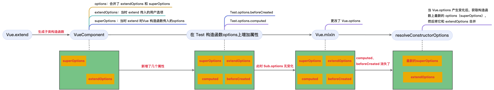
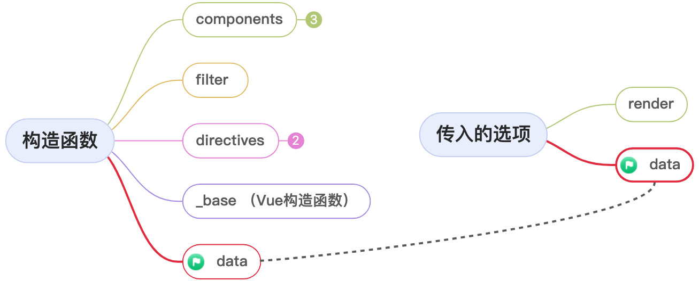

🔥 浅析Vue中的原型设计与选项合并

# 一、Vue的原型设计

Vue是一个基于原型设计的前端框架。

在Vue被引入（`import Vue from 'vue'`）时，会通过多个函数给Vue原型上添加上一系列的方法。

```js
// 该函数在 Vue被引入时执行
export function lifecycleMixin(Vue){
    Vue.prototype._update = ()=>{
        // xxxx
    }
}
```

那么在`Vue.prototype`上定义方法有什么作用呢？ 

如下，Vue本质上是一个构造函数：

```js
function Vue(){
    //xxx
}
```

所以我们可以通过 `new关键字` 来创建一个 vue实例。

```js
const vm = new Vue();
```

> 1. `构造函数与原型对象`：每个构造函数都有一个 prototype属性，指向一个对象。这个对象被叫做原型对象，包含了由该构造函数创建的实例共享属性和方法。
>
> 2. `实例对象的 __proto__ 属性`：每个实例对象都有一个 `__proto__` 属性，指向构造函数的原型对象。

所以我们可以得出结论：`Vue构造函数的显式原型（Vue.prototype）和基于它创建的实例的隐式原型（vm.__proto__）指向的是同一块内存空间`。


当 Vue实例访问某个属性时，如果在自身属性中找不到，则会沿着__proto__属性指向的原型对象进行查找，所以通过 vm 可以访问到定义在 Vue.prototype 的属性和方法。

而Vue构造函数同时也是 Function 的实例。

所以：`Vue.__proto__.constructor === Function`。

# 二、Vue.extend利用原型链继承生成“子类“构造函数

Vue.extend是定义在Vue这个构造函数上的方法。

该方法主要用于创建Vue构造函数的“子类“，该“子类“继承 Vue构造函数上的原型方法和原型属性。

虽然Vue在技术上不是传统意义上的类，但是`Vue.extend`提供了一种类似于面向对象编程中继承的方式来定义组件。 

```js
// 对原函数进行了一些简化 只保留了核心
Vue.extend = function(){
    // this 为 Vue构造函数
    const Super = this;
    // Sub 为 VueComponent构造函数，代表组件构造函数
    const Sub = function VueComponent(this){
        // 和 Vue构造函数一样 会调用_init方法
        this._init(options);
    };
    // 基于 Vue.prototype 创建一块新的内存，共享其属性和方法。
    Sub.prototype = Object.create(Super.prototype);
    // 修正 constructor指向
    Sub.prototype.constructor = Sub;
    return Sub;
}
``` 
我们简单的分析一下这几行代码。

> 声明了Super变量和 Sub变量分别指向`Vue构造函数`，和 `VueComponent构造函数`。


如上图所示，基于`Vue原型对象`创建了一块新的内存地址，并将`VueComponent构造函数`的原型对象指向这块地址。
 
所以基于`VueComponent构造函数`创建的实例可以使用定义在 Vue原型上的属性和方法，并且在 `VueComponent构造函数`上修改属性和方法并不会影响到 `Vue构造函数`。 

> 因为原型对象上存在 constructor，所以需要进行修正constructor来确保 constructor指向正确的`VueComponent构造函数`。

因为VueComponent构造函数“继承”了Vue构造函数的属性和方法。

所以可以把VueComponent构造函数看成是Vue构造函数的“子类“。

> 这种实现继承的方法被称为`原型链继承`。  

## 2.1 使用场景

在Vue源码内部和使用Vue编写业务代码时都可以使用 Vue.extend这个 api。

### 2.1.1 内部创建组件

每一个Vue组件都对应着一个实例。

而这些实例都是通过 extend 方法创建的 `VueComponent构造函数` 生成的。 

在render阶段，也就是在生成组件的vnode的时候会通过 extend 方法创建`VueComponent构造函数`。

并赋值到 vnode 中的 componentOptions属性中。

> 这里的`_base`实际上就是 Vue。

```js
export function createComponent(Ctor,context){
    // _base在引入时被设置为 Vue
    // 这里的options后面我们会详细说明
    const base = context.$options._base;
    // 创建Vue子类构造函数
    Ctor = base.extend();
    return new Vnode(
        {componentOptions:{Ctor}}
    )
}
```

> 这里的 context是vm实例，`vm.$options`是在实例化构造函数时通过 `mergeOptions`函数生成的。

然后在update阶段（渲染页面），会基于Ctor生成对应的实例，执行相应的初始化、渲染方法等。

```js
// 每个组件都会调用这个方法来创建对应的实例
// 这里的 componentOptions.Ctor 就是对应的VueComponent构造函数
export function createComponentInstanceForVnode(vnode){
    return new vnode.componentOptions.Ctor()
}
``` 

### 2.1.2 在业务中的实际应用场景

在实际业务场景中，有很多地方都可以利用 extend 来扩展组件。

包括创建`可复用的组件`、`动态组件`、`全局和局部注册`、`临时组件`、`自定义指令和插件`。

我们常用的 Element框架内部就利用了 Vue.extend 来扩展某些临时性的组件，例如模态对话框、提示信息等。

通过 Vue.extend 创建的组件构造函数可以按需创建和销毁，适合这类临时组件的管理。

```js
const Main = {
    template:'<div>hello main</div>'
}

const NotificationConstructor = Vue.extend(Main);

let instance;

const Notification = function() {
    // 通过VueComponent创建组件实例
    instance = new NotificationConstructor();
    // 使用$mount可以创建一个DOM节点 并挂载到instance.$el上
    instance.$mount();
    document.body.appendChild(instance.$el);
    return instance;
} 

Notification();
```

> $mount方法如果没有传参不会挂载，但是依旧可以生成 DOM节点，并赋值在 vm.$el上。

在 element 中的 Notification组件 就使用了 extend 进行扩展。

## 2.1.3 使用VueComponent继续扩展它的“子类”构造函数

需要关注的是在Vue.extend中，将Vue.extend方法同时赋值给了 VueComponent。

意味着赋予了 VueComponent继续扩展的能力：

```js
Vue.extend = function(){
    const Super = this;
    const Sub = function VueComponent(){
        this._init();
    }
    // 省略部分代码
    Sub.extend = Super.extend;
}
```

这意味着我们可以无限的基于 VueComponent和它的“子类”扩展子类。

```js
import Vue from "@/my-vue2/platforms/web/entry-runtime-with-compiler-esm"

// 基于Vue构造函数创建的基础构造函数
const VueComponentConstructor = Vue.extend({
    template:`<div>{{ name }}我是构造函数</div>`,
    data(){
        return {
            name:"VueComponentConstructor"
        }
    }
});
// 可以复用父类构造函数VueComponentConstructor上的属性
const VueComponentChild1Constructor = VueComponentConstructor.extend({ 
    data(){
        return {
            name:"VueComponentChild1Constructor"
        }
    }
})
// 可以复用父类构造函数VueComponentConstructor上的属性
const VueComponentChild2Constructor = VueComponentConstructor.extend({ 
    data(){
        return {
            name:"VueComponentChild2Constructor"
        }
    }
})

function addNode(){
    const vm1 = new VueComponentConstructor();
    const vm2 = new VueComponentChild1Constructor();
    const vm3 = new VueComponentChild2Constructor();

    vm1.$mount()
    vm2.$mount()
    vm3.$mount()

    document.body.appendChild(vm1.$el)
    document.body.appendChild(vm2.$el)
    document.body.appendChild(vm3.$el)
}

addNode();
```

上述代码中，VueComponentConstructor 是通过 Vue.extend 创建的一个基础组件构造函数。

在这个基础构造函数中传入了模板选项，我们之后创建的构造函数就可以复用 template选项，避免编写重复的模板。


 
我们这里只是简单的举了一个例子，通过这个例子我们了解到了extend的重要意义。真实的复用结构肯定更为复杂。 

不过在实际开发中，一般我们应用中基本只存在 Vue构造函数和它的直接构造函数 VueComponent。

在组件库等基础库中可能会存在这种子类继续扩展子类的情况。

# 三、Vue构造函数的默认选项 

在实例化Vue时，通常我们会将选项对象传入构造函数中，然后注入进Vue实例上便于以后使用。

这些选项可以是 `template定义渲染模板`、`data 定义响应式数据`、`methods定义方法`、`components注册组件`等等。

```js
new Vue({
    template:`<div @click="handleClick">{{ name }}</div>`,
    data(){
        return {
            name:'测试'
        }
    },
    methods:{
        handleClick(){}
    }
})
```

我们知道 `Vue 也是Function构造函数的实例对象`，所以可以在 Vue构造函数上定义一些属性。

Vue.options 即代表Vue的选项。

而Vue内部本身会自带一些默认的选项，这些选项和用户自定义的选项会在后续一起参与到Vue实例的初始化中。

在Vue被引入时，会执行多个方法给Vue.options注入属性。

## 3.1 initGlobalAPI方法创建 Vue.options

initGlobalAPI方法在Vue被引入时执行。

```js
// core/global-api/index.ts

const ASSET_TYPES = ['component','directive','filter'];

const builtInComponents = {
    KeepAlive
}

export function initGlobalAPI(Vue){
    // Object.create用于创建一个没有原型的对象
    Vue.options = Object.create(null)
    ASSET_TYPES.forEach(type => {
      Vue.options[type + 's'] = Object.create(null)
    });
    Vue.options._base = Vue; 
    extend(Vue.options.components, builtInComponents) 
}
```

可以看到，installGlobalAPI方法中创建了 Vue.options为一个纯净的空对象，然后在options上面注入了一些属性。

`_base就是 Vue构造函数`。每个Vue组件都是通过_base属性获取到Vue构造函数，然后使用Vue.extend来生成对应的 VueComponent构造函数。 

> extend方法是vue中的一个通用方法。
>
> 用于将第二个参数的值合并到第一个参数中，返回第一个参数。
>
> 第二个参数的值直接覆盖进第一个参数

```js
export function extend(
  to,
  _from
){
  for (const key in _from) {
    to[key] = _from[key]
  }
  return to
}
```


## 3.2 合并指令

该段逻辑在Vue被引入时执行。

```js
// platforms/web/runtime/index
const platformDirectives = {
    model,
    show
}

const platformComponents = {
    Transition,
    TransitionGroup
}


extend(Vue.options.directives, platformDirectives)
extend(Vue.options.components, platformComponents)
```

扩展了一些跟 web平台相关的指令和组件。

## 3.3 总结

经过我们的研究发现，Vue构造函数的默认选项有：

1. `_base`：值即为Vue构造函数，用于后续创建组件的构造函数。
2. `directive`：代表需要注册的指令，默认的提供了 v-model、v-show的内置指令。
3. `components`：代表需要注册的组件选项，默认提供了 KeepAlive、Transition、TransitionGroup的内置组件。
4. `filter`：代表需要注册的过滤器，默认没有提供默认值。


# 四、子类构造函数的options

学习完上节我们知道在Vue被引入时，在Vue构造函数上创建了一些默认选项。

而 VueComponent构造函数作为 Vue构造函数的子类，是不是也继承了它的默认选项呢？

我们继续打开 Vue.extend 的源码一探究竟。

```js
Vue.extend = function(extendOptions){
    extendOptions = extendOptions || {}
    // 新增_Ctor属性 
    const cachedCtors = extendOptions._Ctor || (extendOptions._Ctor = {})
    const Super = this;
    const Sub = function VueComponent(){
        this._init();
    } 
    // mergeOptions用于合并2个选项返回一个合并选项
    Sub.options = mergeOptions(Super.options, extendOptions)
}
```

虽然我们不知道 mergeOptions的具体逻辑，但是我们很容易看出来，VueComponent构造函数上的 options属性合并了“父类“构造函数上的options属性以及extend方法传入的 options选项。

> 在 VueComponent构造函数上新增了一个_Ctor属性，可以避免每次重新创建子类，提高性能，后面我们会专门说这里，这里不进行展开。

所以我们可以得出一个结论：`子类构造函数的 options选项继承了其父类构造函数的 options选项`。

举个例子：

```js
const VueComponentConstructor = Vue.extend({
    template:`<div>我是子类构造函数</div>`
}); 
``` 
此时 VueComponentConstructor.options 上既包含了自身传入的 template 选项，也包含了继承自Vue构造函数上的属性。

> 这里需要注意的是，继承只是拷贝了一个副本，并不会影响 Vue构造函数的属性。


我们知道，VueComponent构造函数本身是具有再次扩展的能力的。 

```js
const VueComponentChild1Constructor = VueComponentConstructor.extend({
    data(){
        return {
            name:"VueComponentChild1Constructor"
        }
    }
})
```
同理，`VueComponentChild1Constructor是VueComponentConstructor的子类，所以VueComponentChild1Constructor就继承了VueComponentConstructor的 options`。


> 需要注意的时，此时继承的属性是从 VueComponent中继承过来的，跟 Vue.options实际上没有关系了。

# 五、resolveConstructorOptions获取构造函数的 options

在实例上注入选项时需要合并对应构造函数上的选项和实例初始化时传入的选项。

但是在此之前，我们应该需要了解一下`resolveConstructorOptions`函数。

这个函数用于获取实例上对应构造函数的选项.

```js
export function resolveConstructorOptions(Ctor){
    let options = Ctor.options;
    if (Ctor.super) {
        const superOptions = resolveConstructorOptions(Ctor.super)
        const cachedSuperOptions = Ctor.superOptions
        if (superOptions !== cachedSuperOptions) {
            // super option changed,
            // need to resolve new options.
            Ctor.superOptions = superOptions
            // check if there are any late-modified/attached options (#4976)
            const modifiedOptions = resolveModifiedOptions(Ctor)
            // update base extend options
            if (modifiedOptions) {
                extend(Ctor.extendOptions, modifiedOptions)
            }
            options = Ctor.options = mergeOptions(superOptions, Ctor.extendOptions)
            if (options.name) {
                options.components[options.name] = Ctor
            }
        }
    }
    return options;
}
```
看到这么多代码，想必大家也是极其懵逼的。

因为我们之前说过：

1. `Vue构造函数的选项是在初始化时注入的`。

2. `VueComponent及其扩展子类的选项则是在extend方法中进行注入的`。

那直接获取构造函数的选项不就行了，为什么还有这么一大段逻辑呢？

其实这一段逻辑主要是应对父类构造函数上选项变化的情况。

## 5.1 Ctor.super

可以看到只有 Ctor.super 存在时才会走这一大段逻辑。

那么 Ctor.super 指的是什么呢？

在使用 extend生成子类构造函数时，会在子类构造函数上新增了一个 super属性，指向它的父类。

```js
Vue.extend = function(){
    let Sub = function VueComponent(){
        this._init
    }
    let Super = this;
    // 省略部分代码
    // super即代表它的父类
    Sub['super'] = Super;
}
```
所以如果存在 super属性，则代表这是使用 extend生成的 VueComponent构造函数。所以这里分为 2 种情况：

1. 没有super属性，代表这是 Vue构造函数，直接返回 Vue.options 即可。

2. 如果存在super属性，代表这是extend生成的 VueComponent构造函数，需要进行进一步判断。

> VueComponent.options 是合并了父类选项和extend传入选项的全新选项。如果后续Vue.options变化了无法同步获取。

## 5.2 判断父类构造函数上的 options 是否变化

当父类构造函数的选项变化了，需要更新 VueComponent.options。

那么如何检测出父类构造函数的选项变化了呢？

```js
const superOptions = resolveConstructorOptions(Ctor.super)
const cachedSuperOptions = Ctor.superOptions
if (superOptions !== cachedSuperOptions) {
    // 进入这个逻辑说明 Vue.options变化了
}
```

如果 superOptions 不等于 cachedSuperOptions，即表示父类构造函数发生了变化。

所以我们需要搞明白这 2 个值分别表示什么？

1. superOptions 是在resolveConstructorOptions中递归向上查找的，就是表示父类构造函数的选项。

2. cachedSuperOptions 是指的构造函数上的 superOptions属性，这个属性是在 extend中定义的：

```js
Vue.extend = function(){
    let Super = this;
    let Sub = function VueComponent(){
        this._init();
    }
    // 这里存储的就是父类构造函数的 options
    Sub.superOptions = Super.options
}
```

所以这 2 个值都是指的父类构造函数，指向的是同一块内存地址，那么为什么会有不一样的情况呢？

在 Vue 旧版本中曾经有一个相关的 bug。我们先来了解一下这个 bug：

### 5.2.1 Vue旧版本的 bug 

[github issue #4976](https://github.com/vuejs/vue/issues/4976)


这个bug的大概意思就是说：`先生成VueComponent构造函数，然后再在构造函数上的 options 添加属性，在resolveComponentOptions函数执行后，后添加的属性消失了`。

这是复现链接：[options消失](https://jsfiddle.net/vvxLyLvq/2/)。

我们这里看一下代码： 

```js
const Test = Vue.extend({
  foo: 'Foo'
})

// Inject options later
// vue-loader and vue-hot-reload-api are doing like this
Test.options.computed = { $style: { test: 'abcde' } }
Test.options.beforeCreate = [
  () => { console.log('Should be printed') }
]
Test.options.render = function (h) {
  return h('div', '$style: ' + this.$style)
}

// Update super constructor's options
Vue.mixin({})

new Vue({
	render: h => h(Test)
}).$mount('#app')

// This is retained
console.log(Test.options.foo)

// Should be appear but not
console.log(Test.options.computed)
console.log(Test.options.beforeCreate)
```

可以看到首先使用 Vue.extend 生成了一个 Test构造函数。

然后在 Test的 options上新增了 2 个属性。

执行完Vue.mixin后，先前定义的`computed、beforeCreate`2个属性不见了。

### 5.2.2 Vue.mixin

这个 Vue.mixin 究竟干了什么呢？

```js
Vue.mixin = function (mixin: Object) {
    this.options = mergeOptions(this.options, mixin)
    return this
}
```
可以看到mixin函数仅仅是改变了构造函数上的options。

但是 mergeOptions 会返回一个新的对象，导致构造函数的 options 发生了变化。

也就导致了前面说的 `superOptions !== cachedSuperOptions` 情况的发生。

因为 superOptions 获取的是当前最新的选项，也就是 mixin 执行过的合并选项。

而 cachedSuperOptions 则是在执行 Vue.extend 时当时的父类构造函数的选项。

### 5.2.3 旧版本Vue中 resolveConstructorOptions 的逻辑是什么？

但是 Vue.mixin 仅仅是更改了 Vue.options。

应该不会将构造函数自身添加的属性清除。

所以应该是 Vue内部对其做了一些特殊处理。

我们打开 [Vue 2.1.10](https://github.com/vuejs/vue/blob/v2.1.10/src/core/instance/init.js) 版本的相关源码。

```js
export function resolveConstructorOptions (Ctor) {
 let options = Ctor.options
  if (Ctor.super) {
    const superOptions = Ctor.super.options
    const cachedSuperOptions = Ctor.superOptions
    const extendOptions = Ctor.extendOptions
    if (superOptions !== cachedSuperOptions) {
      // super option changed
      Ctor.superOptions = superOptions
      extendOptions.render = options.render
      extendOptions.staticRenderFns = options.staticRenderFns
      extendOptions._scopeId = options._scopeId
      options = Ctor.options = mergeOptions(superOptions, extendOptions)
      if (options.name) {
        options.components[options.name] = Ctor
      }
    }
  }
  return options
}
```

1. 获取了父构造函数的当前的 options：` const superOptions = Ctor.super.options`。
2. 获取了父构造函数extend是生成时的options：`const cachedSuperOptions = Ctor.superOptions`。
3. 获取了子构造函数 extend时传入的选项`extendOptions`。
4. 因为执行了mixin，导致父构造函数中的 options发生了变化，即`superOptions !== cachedSuperOptions`，然后继续执行内部的逻辑。
```js
options = Ctor.options = mergeOptions(superOptions, extendOptions)
```

可以看到它是将获取到的父构造函数 options和当初 extend传入的 options合并，然后重新赋值给了 Ctor.options。

所以后添加的`computed`、`beforeCreate`就消失了，因为指向了不同的内存空间。



### 5.2.4 总结

通过上面几节的学习，我们知道了为什么需要判断父类构造函数的变化。

我们系统提供了全局注入的 API：`Vue.mixin`。

使用这个函数可以向全局注入一些选项。

而实际上就是通过改变Vue构造函数上的option，再通过这里的变更逻辑重新赋值到 VueComponent.options上，这样生成的实例就可以访问到 Vue.mixin注入的属性了。

## 5.3 使用resolveModifiedOptions获取更改的属性

应对上面说的这个 bug，Vue官方也对这resolveConstructorOptions方法进行了调整。

针对VueComponent构造函数上可能存在的options更改进行了处理。

1. 首先在 Vue.extends中保存了VueComponent的当时的options。

```js
Vue.extend = function(){
    // 省略部分代码
    // 存储了当时的 options
    Sub.sealedOptions = extend({}, Sub.options)
}
```
2. 使用resolveModifiedOptions查找修改的option部分

```js
function resolveModifiedOptions(Ctor){
  let modified
  const latest = Ctor.options
  const sealed = Ctor.sealedOptions
  for (const key in latest) {
    if (latest[key] !== sealed[key]) {
      if (!modified) modified = {}
      modified[key] = latest[key]
    }
  }
  return modified
}
```

3. 将修改的 options合进 extendOptions

```js
if (modifiedOptions) {
    extend(Ctor.extendOptions, modifiedOptions)
}
```

## 5.4 总结

这个函数可以获取到构造函数上最新的options。

同时可以更新子类构造函数和父类构造函数上的`superOptions、extendOptions以及 options`。

# 六、合并策略

在构造函数实例化的时候，会将构造函数上的选项和用户传入的选项进行合并。

mergeOptions函数用于合并2 个 options选项，并返回一个新的 options。

这个函数是继承和实例化的核心函数。

```js
vm.$options = mergeOptions(
    resolveConstructorOptions(vm.constructor),
    options,
    vm
)
```
大家可以思考一下合并2个对象需要注意些什么呢？

假设构造函数的options和传入的options中都存在data，这个时候合并的是`1.直接覆盖？2.如果覆盖的话是使用构造函数的data还是传入的data? 3.还是将data中的内容再进行合并呢？`



实际上选项中的每一项都存在自己的合并逻辑，这就是合并策略。

```js
function mergeOptions(parent,child){
    // 省略部分代码
    let key
    const options: ComponentOptions = {};
    for(key in parent){
        mergeField(key)
    }
    for (key in child) {
        if (!hasOwn(parent, key)) {
            mergeField(key)
        }
    }
    function mergeField(key){
        const strat = strats[key] || defaultStrat;
        options[key] = strat(parent[key], child[key], vm, key)
    }
    return options;
}
```

## 6.1 默认的合并策略

由于可以选项高度可自定义，所以 Vue中内置了一套默认的合并策略，主要应对没有设置对应策略的合并情况。

```js
const defaultStrat = function (parentVal, childVal) {
  return childVal === undefined ? parentVal : childVal
}
```
可以看出来默认的合并策略是传入的 options直接对构造函数的 options进行强制覆盖（如果存在的话）。

## 6.2 el、propsData的合并策略

可以看出来 el、propsData的合并策略和默认策略一样，只是多了一个开发环境的报错提示

```js
if (__DEV__) {
  strats.el = strats.propsData = function (
    parent: any,
    child: any,
    vm: any,
    key: any
  ) {
    if (!vm) {
      warn(
        `option "${key}" can only be used during instance ` +
          'creation with the `new` keyword.'
      )
    }
    return defaultStrat(parent, child)
  }
}
```

## 6.3 data的合并策略

data选项在 Vue中无疑是使用最频繁的选项之一。

所以它的合并策略相当复杂。

```js
strats.data = function (
  parentVal,
  childVal,
  vm
){
  return mergeDataOrFn(parentVal, childVal, vm)
}
```

### 6.3.1 mergeDataOrFn 

```js
export function mergeDataOrFn(
    parentVal,
    childVal,
    vm
) {
    return function mergedInstanceDataFn() {
        // instance merge
        const instanceData = isFunction(childVal)
            ? childVal.call(vm, vm)
            : childVal
        const defaultData = isFunction(parentVal)
            ? parentVal.call(vm, vm)
            : parentVal
        if (instanceData) {
            return mergeData(instanceData, defaultData)
        } else {
            return defaultData
        }
    }
}
```
该函数生成了一个合并函数。

`当这个合并函数执行的时候将获取构造函数的上的data和传入的data`

1. 当传入的选项中存在 data，则调用 mergeData合并 2 个 data。
2. 当传入的选项中不存在 data时，则直接返回构造函数上的 data。

### 6.3.2 mergeData

当构造函数的选项和传入的选项都存在 data时，需要调用 mergeData对 2 个选项进行合并。

```js

```

## 6.4 生命周期的合并策略

```js

export const LIFECYCLE_HOOKS = [
  'beforeCreate',
  'created',
  'beforeMount',
  'mounted',
  'beforeUpdate',
  'updated',
  'beforeDestroy',
  'destroyed',
  'activated',
  'deactivated',
  'errorCaptured',
  'serverPrefetch',
  'renderTracked',
  'renderTriggered'
] as const

LIFECYCLE_HOOKS.forEach(hook => {
  strats[hook] = mergeLifecycleHook
})

export function mergeLifecycleHook(
  parentVal,
  childVal
){
  const res = childVal
    ? parentVal
      ? parentVal.concat(childVal)
      : isArray(childVal)
      ? childVal
      : [childVal]
    : parentVal
  return res ? dedupeHooks(res) : res
}
function dedupeHooks(hooks) {
  const res = []
  for (let i = 0; i < hooks.length; i++) {
    if (res.indexOf(hooks[i]) === -1) {
      res.push(hooks[i])
    }
  }
  return res
}
```
mergeLifecycleHook函数的三元运算符还是比较复杂的，我们来解析一下。

* 如果 childVal存在，检查 parentVal是否存在
* 如果 parentVal存在，使用 concat方法将 parentVal和 childVal合并成一个新数组
* 如果 parentVal不存在，检查 childVal是否为数组。
    1. 如果是数组，直接返回 childVal
    2. 如果不是数组，将 childVal包装成一个数组

dedupeHooks函数就是对合并的选项进行去重操作。

> 综上所述，生命周期的合并策略就是合并父构造器和传入的选项，将其转化为数组。

## 6.5 组件、指令、过滤器的合并策略

```js
export const ASSET_TYPES = ['component', 'directive', 'filter']

ASSET_TYPES.forEach(function (type) {
  strats[type + 's'] = mergeAssets
})

function mergeAssets(
  parentVal,
  childVal,
  vm,
  key
) {
  const res = Object.create(parentVal || null)
  if (childVal) {
    return extend(res, childVal)
  } else {
    return res
  }
}
```
很明显 组件、指令、过滤器的合并策略就是直接对构造函数的选项进行覆盖。


